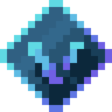

   
  <h1 align="center">VALO.mini</h1>

Developed by  
<ul>
  <li><a href="https://github.com/gdderije">Gisselle Derije</a></li>
  <li><a href="https://github.com/lssagun2">Leandrei Sagun</a></li>
</ul>

<h2>Overview</h2>
It’s a fight for survival! Valo.mini is a small-scale, frenetic, top-down 2D battle royale pimped with pixelart and static map design. Choose your fighter, your gun, and join the arena to confront other players in nervous and punitive matches. Impose your gameplay and reach the top!  
<i>Valo.mini</i> is a server-based 2D battle royale game inspired by the team-based tactical first-person shooting game (FPS), Valorant, and a browser-based multiplayer battle royale game, Surviv.io. 

<h2>User Stories</h2>
<ul>
  <li>As a player, I should be able to pick a class and my ‘loadout’ from the corresponding set of skills.</li>
  <li>As a player, I should be able to see my health status during the game.</li>
  <li>As a player, I should see obstacles and guns in the map and be able to use them as cover and weapon.</li>
</ul>

<h2>Tech Stack</h2>
<ul>
  <li>Python</li>
  <li>Pygame module</li>
  <li>Aseprite</li>
</ul>

<h2>Minimum Viable Product</h2>
<ul>
  <li>The map and its corresponding entities, especially obstacles and weapons, are created when at least one player has started a game.</li>
  <li>Bullets should travel at certain paths and certain speeds depending on the weapon used but they should stop when encountering a player or an obstacle. They should also inflict damage when hitting a player, which also depends on the weapon and the distance from the other player.</li>
  <li>Players can choose from multiple classes, and each class has its own set of skills they can choose from. </li>
</ul>

<h2>Stretch Goals</h2>
<ul>
  <li>Users can access their game history.</li>
  <li>Players can share their achievements in different social media platforms.</li>
  <li>A game can have a team mode with teams having a maximum number of three members, preferably all having different classes.</li>
  <li>Players in teams can use text-chat or voice-chat to communicate with other team members.</li>
  <li>Players’ visions can be limited to only a certain angle in the direction they are looking at. Players in teams share the vision of other members of the team.</li>
  <li>Players can watch a replay of the previous match.</li>
</ul>
